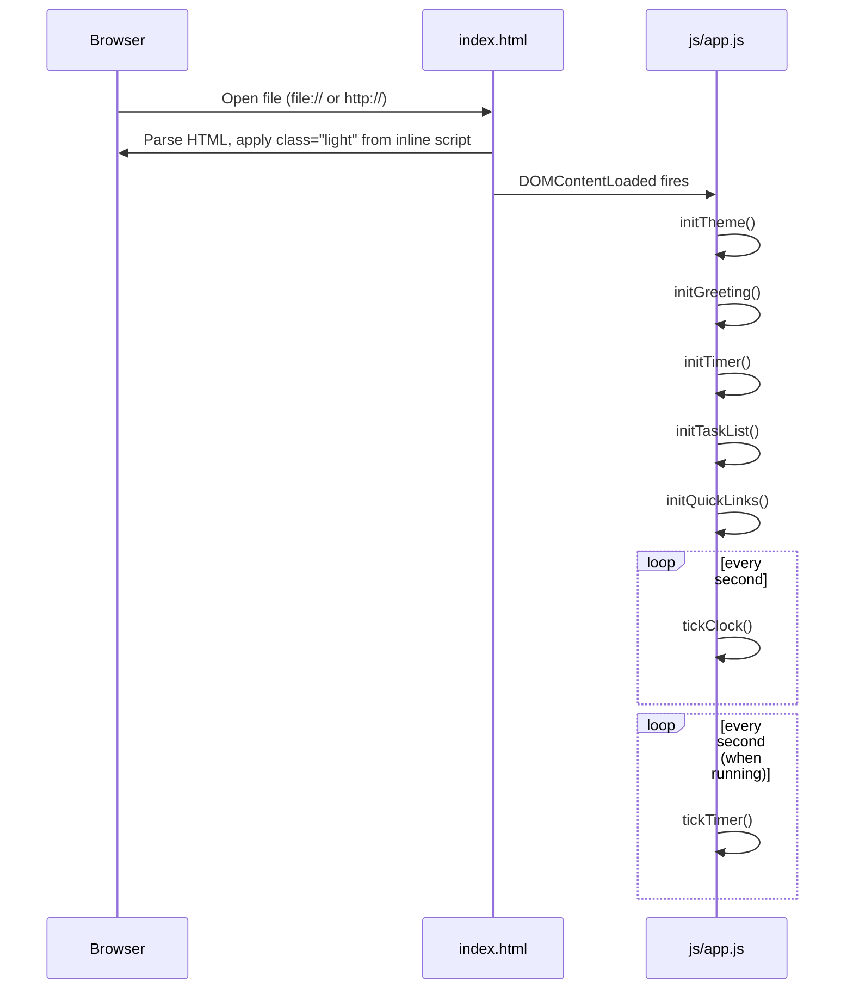

# Design Document: Personal Dashboard

## Overview

The Personal Dashboard is a single-page productivity web application delivered as a set of three static files (`index.html`, `css/style.css`, `js/app.js`). It requires no build step, no server, and no external dependencies. The application runs entirely in the browser, with all user data stored in `localStorage`.

The page is divided into five independent widgets:

| Widget | Purpose |
|--------|---------|
| Greeting Widget | Date, clock, time-based greeting, and user name |
| Focus Timer | 25-minute Pomodoro countdown |
| Task List | To-do items with add / edit / complete / delete / sort |
| Quick Links | Shortcut buttons to favourite websites |
| Theme Toggle | Switches between light and dark themes |

Each widget owns its own data key(s) in `localStorage` and manages its own DOM subtree. All widgets are initialised once on `DOMContentLoaded` and then update themselves via timers or event listeners.

---

## Architecture

### High-Level Structure

```
index.html          – semantic HTML skeleton, one <script> tag at end of <body>
css/style.css       – all styles including CSS custom properties for theming
js/app.js           – all application logic, organised into widget modules
```

No module bundler is used. `js/app.js` is a single IIFE-wrapped file with a clear section per widget plus shared utilities.

### Execution Flow



### Theme Flash Prevention

A small inline `<script>` in `<head>` (before any CSS) reads `localStorage.getItem('theme')` and sets `document.documentElement.className` immediately. This runs synchronously before the first paint and prevents a flash of the wrong theme.

```html
<script>
  (function () {
    var t = localStorage.getItem('theme');
    document.documentElement.className = t === 'dark' ? 'dark' : 'light';
  }());
</script>
```

### Module Layout in `js/app.js`

```
(function () {
  // ─── Shared Utilities ─────────────────────────────
  //   Storage helpers (safeGet, safeSet)
  //   DOM helpers (qs, qsa, createElement)

  // ─── Widget: Theme ────────────────────────────────
  //   initTheme(), toggleTheme()

  // ─── Widget: Greeting ─────────────────────────────
  //   initGreeting(), tickClock(), greetingText(hour)
  //   loadName(), saveName(), clearName()

  // ─── Widget: Focus Timer ──────────────────────────
  //   initTimer(), startTimer(), stopTimer(), resetTimer()
  //   tickTimer(), formatTime(seconds)

  // ─── Widget: Task List ────────────────────────────
  //   initTaskList(), addTask(), editTask(), toggleTask()
  //   deleteTask(), sortTasks(), renderTasks(), persistTasks()

  // ─── Widget: Quick Links ──────────────────────────
  //   initQuickLinks(), addLink(), deleteLink()
  //   renderLinks(), persistLinks()

  // ─── Bootstrap ────────────────────────────────────
  document.addEventListener('DOMContentLoaded', function () {
    initTheme();
    initGreeting();
    initTimer();
    initTaskList();
    initQuickLinks();
  });
}());
```

---

## Components and Interfaces

### 1. Shared Utilities

| Function | Signature | Description |
|----------|-----------|-------------|
| `safeGet` | `(key: string) → string \| null` | Wraps `localStorage.getItem`; returns `null` on error |
| `safeSet` | `(key: string, value: string) → boolean` | Wraps `localStorage.setItem`; returns `false` on quota/error |
| `qs` | `(selector: string, root?: Element) → Element \| null` | Alias for `querySelector` |
| `qsa` | `(selector: string, root?: Element) → NodeList` | Alias for `querySelectorAll` |

### 2. Theme Widget

| Function | Description |
|----------|-------------|
| `initTheme()` | Reads saved theme from storage; applies CSS class; sets correct icon |
| `toggleTheme()` | Flips class on `<html>`, persists new value, updates icon |

**DOM interface:**
```
#theme-toggle (button)  – click triggers toggleTheme()
#theme-icon   (img/svg) – src/class updated to reflect current theme
```

### 3. Greeting Widget

| Function | Signature | Description |
|----------|-----------|-------------|
| `greetingText` | `(hour: number) → string` | Pure function; returns greeting phrase for a given 0–23 hour |
| `formatDate` | `(date: Date) → string` | Returns `"Weekday, Month DD, YYYY"` |
| `formatTime` | `(date: Date) → string` | Returns `"HH:MM:SS"` |
| `tickClock` | `() → void` | Called every second via `setInterval`; updates DOM |
| `loadName` | `() → string` | Reads name from `localStorage['dashboard-name']` |
| `saveName` | `(name: string) → void` | Validates and writes name; updates greeting |
| `clearName` | `() → void` | Removes key; updates greeting |

**DOM interface:**
```
#greeting-text    – greeting phrase + optional name
#date-display     – formatted date
#time-display     – formatted HH:MM:SS
#name-input       – text input, maxlength=50
#name-save-btn    – triggers saveName/clearName
```

### 4. Focus Timer Widget

| Function | Signature | Description |
|----------|-----------|-------------|
| `formatTimerDisplay` | `(totalSeconds: number) → string` | Returns `"MM:SS"` string |
| `initTimer` | `() → void` | Sets remaining=1500, renders, binds buttons |
| `startTimer` | `() → void` | Guards against double-start; begins 1s interval |
| `stopTimer` | `() → void` | Clears interval; retains remaining time |
| `resetTimer` | `() → void` | Clears interval; sets remaining=1500; renders |
| `tickTimer` | `() → void` | Decrements remaining; renders; triggers alert at 0 |
| `showAlert` | `() → void` | Displays visible on-page message; plays beep (Web Audio) |

**DOM interface:**
```
#timer-display    – shows MM:SS
#timer-start      – disabled while running
#timer-stop       – disabled while stopped/paused
#timer-reset      – always enabled
#timer-alert      – hidden by default, shown at 00:00
```

**State machine:**
```
STOPPED → (start) → RUNNING → (stop) → PAUSED → (start) → RUNNING
RUNNING → (00:00)  → STOPPED
*       → (reset)  → STOPPED
```

### 5. Task List Widget

| Function | Signature | Description |
|----------|-----------|-------------|
| `addTask` | `(text: string) → void` | Validates 1–200 chars; pushes to array; persists; renders |
| `editTask` | `(id: string, newText: string) → void` | Validates non-empty; updates in array; persists; renders |
| `toggleTask` | `(id: string) → void` | Flips `done` flag; persists; renders |
| `deleteTask` | `(id: string) → void` | Removes from array; persists; renders |
| `sortTasks` | `() → void` | Stable-sorts tasks (incomplete first); sets sort flag; persists |
| `renderTasks` | `() → void` | Rebuilds task list DOM from in-memory array |
| `persistTasks` | `() → void` | JSON-encodes array + sort flag; calls `safeSet` |

**DOM interface:**
```
#task-input        – text input, maxlength=200
#task-add-btn      – triggers addTask
#task-sort-btn     – triggers sortTasks
#task-list         – <ul> rebuilt on every render
  └─ .task-item    – <li> per task
       ├─ .task-checkbox  – triggers toggleTask
       ├─ .task-text      – inline-edit target
       ├─ .task-edit-btn  – activates inline edit
       └─ .task-delete-btn
#task-validation   – inline error message
```

### 6. Quick Links Widget

| Function | Signature | Description |
|----------|-----------|-------------|
| `addLink` | `(label: string, url: string) → void` | Validates; guards duplicates; max 20; persists; renders |
| `deleteLink` | `(index: number) → void` | Removes by index; persists; renders |
| `renderLinks` | `() → void` | Rebuilds link buttons from in-memory array |
| `persistLinks` | `() → void` | JSON-encodes array; calls `safeSet` |
| `isValidUrl` | `(url: string) → boolean` | Returns true iff URL starts with `http://` or `https://` |

**DOM interface:**
```
#link-label-input    – text input, maxlength=50
#link-url-input      – text input, maxlength=2048
#link-add-btn        – triggers addLink; disabled at 20 links
#links-grid          – container for link buttons
  └─ .link-item      – button wrapper per link
       ├─ .link-btn  – <a target="_blank"> 
       └─ .link-delete-btn
#link-validation     – inline error message
#link-limit-msg      – visible when count === 20
```

---

## Data Models

### LocalStorage Keys

| Key | Type | Description |
|-----|------|-------------|
| `dashboard-theme` | `"light" \| "dark"` | Active theme identifier |
| `dashboard-name` | `string` (0–50 chars) | User name for greeting |
| `dashboard-tasks` | JSON (see below) | Serialised task collection |
| `dashboard-links` | JSON (see below) | Serialised link collection |

### Task Object

```json
{
  "id": "t_1720000000000",
  "text": "Buy groceries",
  "done": false,
  "createdAt": 1720000000000
}
```

| Field | Type | Constraints |
|-------|------|-------------|
| `id` | `string` | `"t_" + Date.now()` at creation; unique |
| `text` | `string` | 1–200 characters |
| `done` | `boolean` | `false` = incomplete, `true` = complete |
| `createdAt` | `number` | Unix timestamp ms; used as insertion-order tie-breaker |

### Tasks Storage Envelope

```json
{
  "tasks": [ /* array of Task objects */ ],
  "sorted": false
}
```

The `sorted` flag records whether the last user action was a sort, so that order can be restored correctly on reload.

### Link Object

```json
{
  "label": "GitHub",
  "url": "https://github.com"
}
```

| Field | Type | Constraints |
|-------|------|-------------|
| `label` | `string` | 1–50 characters |
| `url` | `string` | 1–2048 chars; must start with `http://` or `https://` |

### Links Storage

The links array is stored directly as a JSON array of Link objects:

```json
[
  { "label": "GitHub", "url": "https://github.com" },
  { "label": "MDN",    "url": "https://developer.mozilla.org" }
]
```

---

## Correctness Properties

*A property is a characteristic or behavior that should hold true across all valid executions of a system — essentially, a formal statement about what the system should do. Properties serve as the bridge between human-readable specifications and machine-verifiable correctness guarantees.*


### Property 1: Date format is always correct

*For any* `Date` object, `formatDate(date)` SHALL return a string in the exact format `"Weekday, Month DD, YYYY"` where Weekday is the correct full weekday name, Month is the correct full month name, DD is a zero-padded two-digit day, and YYYY is the four-digit year matching the input date.

**Validates: Requirements 1.1**

---

### Property 2: Time format is always correct

*For any* `Date` object, `formatTime(date)` SHALL return a string in the exact format `"HH:MM:SS"` where each component is a zero-padded two-digit number whose value matches the hours, minutes, and seconds of the input date.

**Validates: Requirements 1.2**

---

### Property 3: Greeting phrase is correct for all hours

*For any* integer hour in the range 0–23, `greetingText(hour)` SHALL return exactly:
- `"Good Morning"` when `hour` is in [5, 11]
- `"Good Afternoon"` when `hour` is in [12, 16]
- `"Good Evening"` when `hour` is in [17, 20]
- `"Good Night"` when `hour` is in [21, 23] or [0, 4]

Every integer hour in 0–23 must map to exactly one greeting phrase with no gaps or overlaps.

**Validates: Requirements 1.3, 1.4, 1.5, 1.6**

---

### Property 4: Saved name appears in the greeting

*For any* name string of 1–50 characters, after `saveName(name)` is called, the displayed greeting text SHALL contain the saved name as a suffix.

**Validates: Requirements 1.8**

---

### Property 5: Name persistence round-trip

*For any* name string of 1–50 characters, calling `saveName(name)` SHALL write the name to `localStorage` under `dashboard-name`, such that a subsequent `loadName()` returns the identical string. Calling `clearName()` after a save SHALL cause `loadName()` to return `null`.

**Validates: Requirements 1.9, 1.11**

---

### Property 6: Timer display format is correct for all durations

*For any* integer `seconds` in the range 0–1500, `formatTimerDisplay(seconds)` SHALL return a string matching `"MM:SS"` where `MM` is a zero-padded two-digit minute count and `SS` is a zero-padded two-digit seconds count, and `MM * 60 + SS === seconds`.

**Validates: Requirements 2.4**

---

### Property 7: Adding any valid task persists it correctly

*For any* string `text` of 1–200 characters, calling `addTask(text)` SHALL add an entry to the in-memory task array and to `localStorage['dashboard-tasks']` such that the stored JSON, when parsed, contains a task whose `text` field equals the input and whose `done` field is `false`.

**Validates: Requirements 3.2, 3.8**

---

### Property 8: Whitespace-only or empty task input is rejected

*For any* string composed entirely of whitespace characters (including the empty string), calling `addTask(text)` SHALL leave the task array unchanged and SHALL set a non-empty inline validation message.

**Validates: Requirements 3.3**

---

### Property 9: Task completion toggle is its own inverse

*For any* task with a `done` value of `d`, calling `toggleTask(id)` SHALL set `done` to `!d`. Calling `toggleTask(id)` a second time SHALL restore `done` to `d` (i.e., double-toggle is the identity).

**Validates: Requirements 3.4**

---

### Property 10: Task edit updates text for valid input; rejects whitespace

*For any* existing task and any non-empty replacement string of 1–200 characters, calling `editTask(id, newText)` SHALL update the task's `text` to `newText` in both the in-memory array and `localStorage`. For any replacement string composed entirely of whitespace, `editTask` SHALL leave the task unchanged.

**Validates: Requirements 3.5**

---

### Property 11: Deleting a task removes it from storage

*For any* task list containing at least one task, calling `deleteTask(id)` for any task `id` in the list SHALL ensure that no task with that `id` remains in the array or in the parsed JSON from `localStorage['dashboard-tasks']`.

**Validates: Requirements 3.6, 3.8**

---

### Property 12: Sort places all incomplete tasks before all completed tasks

*For any* task array with any mix of `done` values, calling `sortTasks()` SHALL produce an ordering where every task with `done === false` appears at a lower index than every task with `done === true`. Tasks within the same `done` group SHALL preserve their relative order (stable sort).

**Validates: Requirements 3.7**

---

### Property 13: Task list persistence round-trip

*For any* array of tasks, persisting the array via `persistTasks()` and then reading and parsing `localStorage['dashboard-tasks']` SHALL yield an object whose `tasks` array is deeply equal to the input array, and whose `sorted` flag matches the current sort state.

**Validates: Requirements 3.8, 3.9**

---

### Property 14: Adding any valid link stores it correctly

*For any* label of 1–50 characters and any URL of 1–2048 characters starting with `http://` or `https://`, calling `addLink(label, url)` SHALL add an entry to the links array and to `localStorage['dashboard-links']` such that the stored JSON, when parsed, contains a link with matching `label` and `url` fields.

**Validates: Requirements 4.2, 4.6**

---

### Property 15: Invalid or duplicate link input is rejected

*For any* combination of inputs that violates at least one constraint (empty label, empty URL, URL not starting with `http://` or `https://`, URL already present in the list), calling `addLink` SHALL leave the links array unchanged and SHALL set a non-empty inline validation message.

**Validates: Requirements 4.3**

---

### Property 16: Deleting a link removes it from storage

*For any* links array containing at least one link, calling `deleteLink(index)` for any valid index SHALL ensure the link at that index no longer appears in the array or in the parsed JSON from `localStorage['dashboard-links']`.

**Validates: Requirements 4.5, 4.6**

---

### Property 17: Link list persistence round-trip

*For any* array of link objects, persisting via `persistLinks()` and then reading and parsing `localStorage['dashboard-links']` SHALL yield an array that is deeply equal to the input array.

**Validates: Requirements 4.6, 4.7**

---

### Property 18: Theme toggle icon reflects the active theme

*For any* starting theme state (`"light"` or `"dark"`), after `toggleTheme()` is called, the icon element's `src` or class attribute SHALL reflect the new (opposite) theme. Calling `toggleTheme()` again SHALL return the icon to its original state (toggle is its own inverse on the icon).

**Validates: Requirements 5.3**

---

### Property 19: Theme persistence round-trip

*For any* sequence of `toggleTheme()` calls, the value stored in `localStorage['dashboard-theme']` SHALL always equal the currently active theme class on `<html>` (`"light"` or `"dark"`), and a subsequent `initTheme()` call SHALL apply that same class.

**Validates: Requirements 5.4, 5.5**

---

## Error Handling

### LocalStorage Failures

All reads and writes to `localStorage` are wrapped in `try/catch` via `safeGet` and `safeSet`.

| Scenario | Behaviour |
|----------|-----------|
| `safeGet` throws (e.g. private mode blocked) | Returns `null`; widget uses defaults |
| `safeSet` throws (quota exceeded) | Returns `false`; widget displays a small error badge (e.g. red dot on the widget header); UI remains interactive |
| Theme `safeSet` fails | Theme is applied in-memory for the session; no visible error (Requirement 5.7) |

### Input Validation

| Widget | Invalid Input | Response |
|--------|--------------|----------|
| Greeting name | Empty after confirm | Treated as `clearName()` — removes name |
| Task | Empty / whitespace-only | Inline message below input; task not added |
| Task edit | Empty / whitespace-only | Inline message; edit cancelled |
| Quick Links | Bad label, bad URL, duplicate URL | Inline message below form; link not added |
| Quick Links | 20 links already present | "Add Link" button disabled; limit message shown |

Inline validation messages are cleared as soon as the offending input changes (`input` event listener).

### Timer Alert

When the timer reaches 00:00:
1. A visible `#timer-alert` element is un-hidden with a text message ("Session complete!").
2. A short beep is attempted via the Web Audio API (`AudioContext` → `OscillatorNode`). If the browser blocks audio without a prior user gesture, the error is silently caught; the visible alert still appears.

---

## Testing Strategy

### Dual Testing Approach

The project uses two complementary layers of testing:

- **Unit / example tests** — verify specific scenarios, boundary conditions, and DOM state
- **Property-based tests** — verify universal properties across many randomised inputs (minimum 100 iterations each)

### Property-Based Testing Library

For a pure-HTML/JS project with no build step, testing is done with **[fast-check](https://fast-check.dev/)** loaded via CDN in the test HTML harness. Each correctness property defined in this document maps to exactly one `fc.assert(fc.property(...))` call.

### Property Test Tags

Every property test file contains a comment header:

```js
// Feature: personal-dashboard, Property <N>: <property_text>
```

Example:

```js
// Feature: personal-dashboard, Property 3: Greeting phrase is correct for all hours
fc.assert(
  fc.property(fc.integer({ min: 0, max: 23 }), (hour) => {
    const result = greetingText(hour);
    if (hour >= 5  && hour <= 11) return result === 'Good Morning';
    if (hour >= 12 && hour <= 16) return result === 'Good Afternoon';
    if (hour >= 17 && hour <= 20) return result === 'Good Evening';
    return result === 'Good Night';
  }),
  { numRuns: 100 }
);
```

### Unit Test Coverage

| Area | Focus |
|------|-------|
| Timer state machine | All transitions: STOPPED→RUNNING, RUNNING→PAUSED, PAUSED→RUNNING, any→STOPPED (reset), RUNNING→STOPPED (00:00) |
| Timer button states | Disabled/enabled on each state transition |
| Quick Links cap | Boundary at exactly 20 links |
| Theme default | No storage → light theme applied |
| LocalStorage failure | Mock `setItem` to throw; verify graceful degradation |
| Link opens new tab | `<a target="_blank">` attribute present |

### Property Test Coverage Matrix

| Property # | Function under test | Arbitraries used |
|------------|-------------------|-----------------|
| 1 | `formatDate` | `fc.date()` |
| 2 | `formatTime` | `fc.date()` |
| 3 | `greetingText` | `fc.integer({min:0, max:23})` |
| 4 | `saveName` + greeting render | `fc.string({minLength:1, maxLength:50})` |
| 5 | `saveName` / `loadName` / `clearName` | `fc.string({minLength:1, maxLength:50})` |
| 6 | `formatTimerDisplay` | `fc.integer({min:0, max:1500})` |
| 7 | `addTask` + `persistTasks` | `fc.string({minLength:1, maxLength:200})` |
| 8 | `addTask` (rejection) | `fc.stringMatching(/^\s*$/)` |
| 9 | `toggleTask` | `fc.array(taskArb)` + index |
| 10 | `editTask` | `fc.array(taskArb)`, `fc.string(...)` |
| 11 | `deleteTask` + `persistTasks` | `fc.array(taskArb, {minLength:1})` + index |
| 12 | `sortTasks` | `fc.array(taskArb)` |
| 13 | `persistTasks` round-trip | `fc.array(taskArb)` |
| 14 | `addLink` + `persistLinks` | `fc.string(...)`, valid URL arbitrary |
| 15 | `addLink` (rejection) | invalid inputs: empty strings, bad-scheme URLs, duplicates |
| 16 | `deleteLink` + `persistLinks` | `fc.array(linkArb, {minLength:1})` + index |
| 17 | `persistLinks` round-trip | `fc.array(linkArb)` |
| 18 | `toggleTheme` icon | starting theme in `{'light','dark'}` |
| 19 | `toggleTheme` + `initTheme` | starting theme + toggle count |

### Cross-Browser & Responsive Testing

Manual verification in Chrome, Firefox, Edge, and Safari covering:
- Viewport widths: 320px, 768px, 1280px, 1920px, 2559px
- Light and dark theme rendering
- LocalStorage behaviour in private/incognito mode
- Web Audio API fallback (silent fail, visual alert present)
